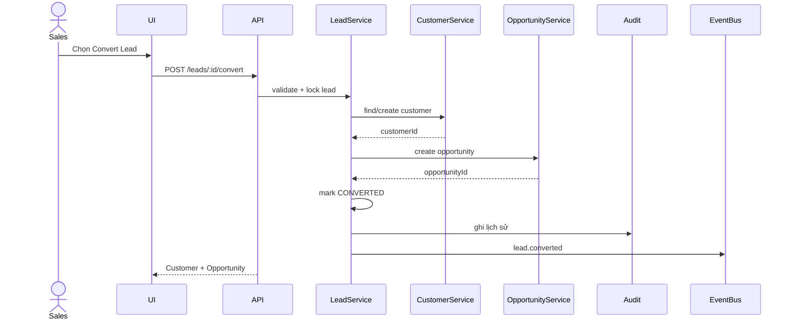
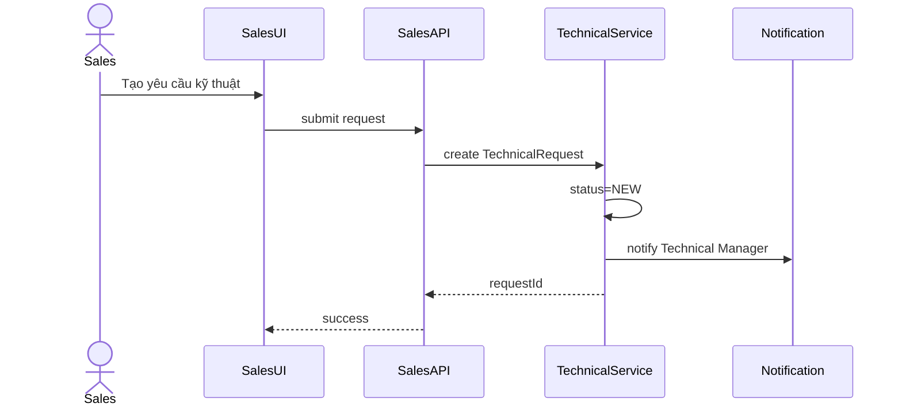
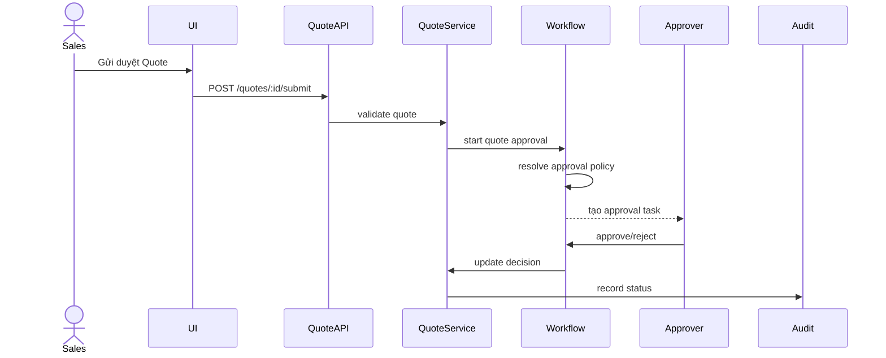
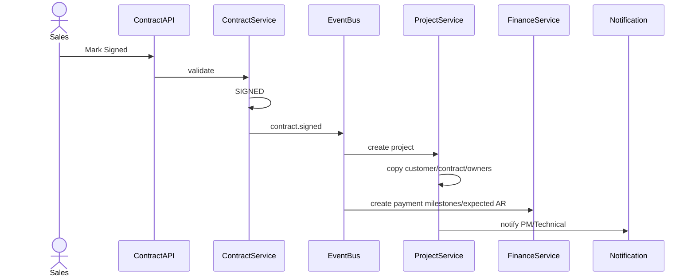
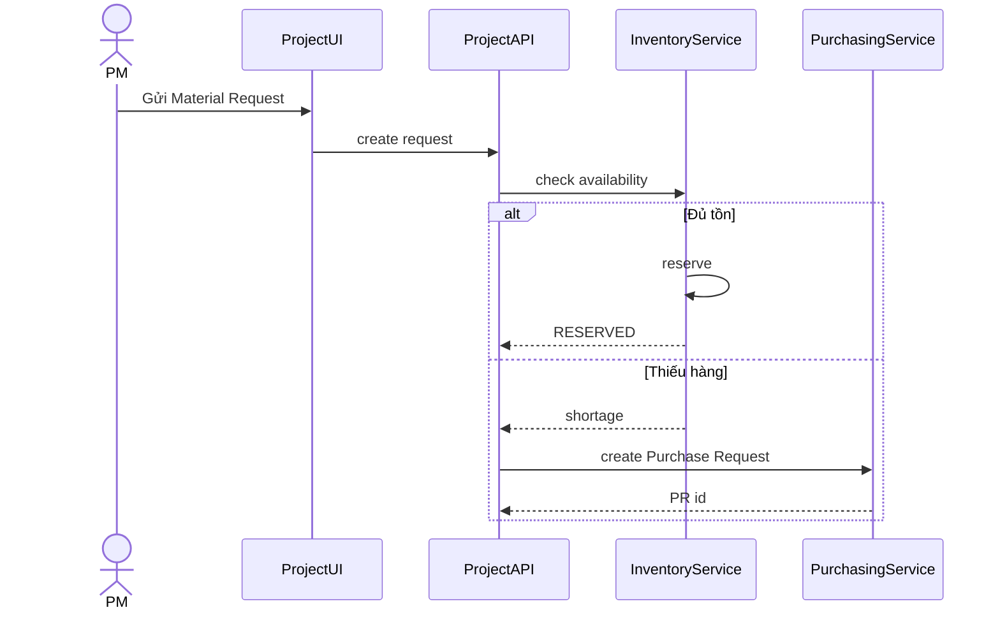
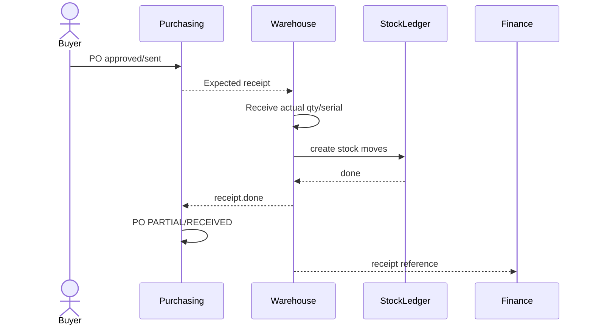
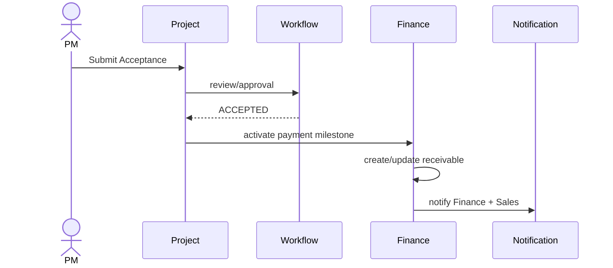
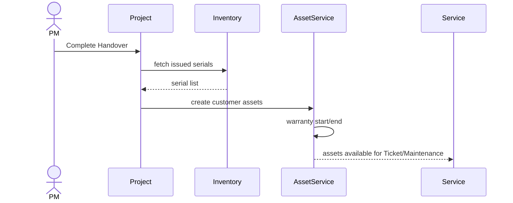
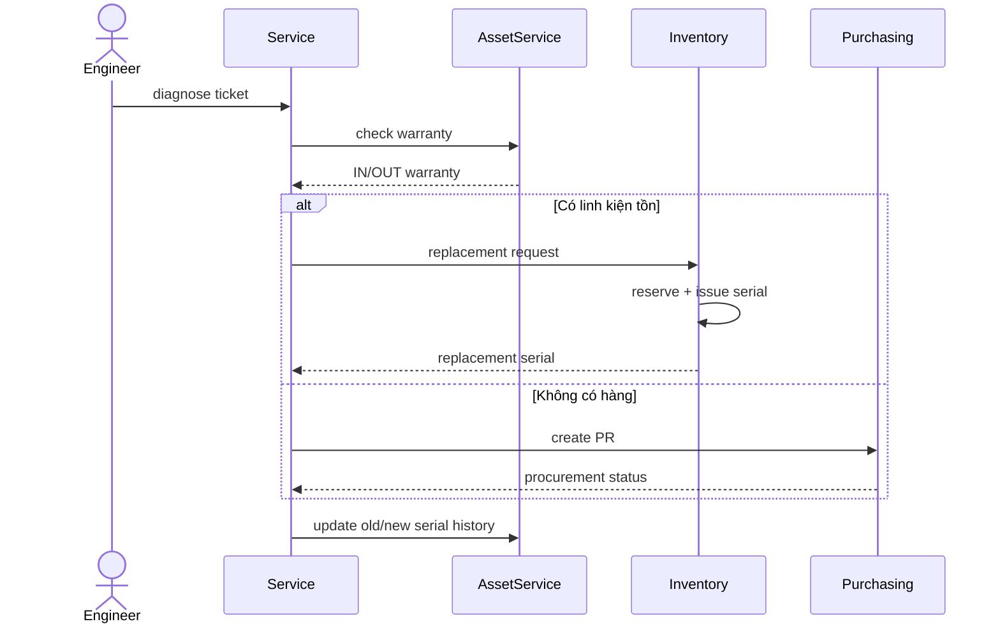
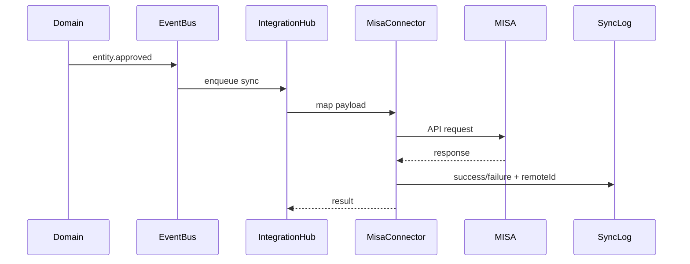

# SEQUENCE DIAGRAMS – CÁC LUỒNG NGHIỆP VỤ CHÍNH

## 1. Lead → Opportunity

Yêu cầu:
- transaction;
- chống convert hai lần;
- chống Customer trùng;
- audit.

---

## 2. Opportunity → Technical Request

---

## 3. Quote Approval

---

## 4. Contract Signed → Create Project

---

## 5. Material Request → Kho/Mua hàng

---

## 6. Purchase Order → Receipt

---

## 7. Project Acceptance → Receivable

---

## 8. Handover → Customer Asset

---

## 9. Warranty Ticket → Replacement

---

## 10. MISA Sync

Retry:
- chỉ retry lỗi phù hợp;
- chống duplicate bằng mapping/idempotency.
